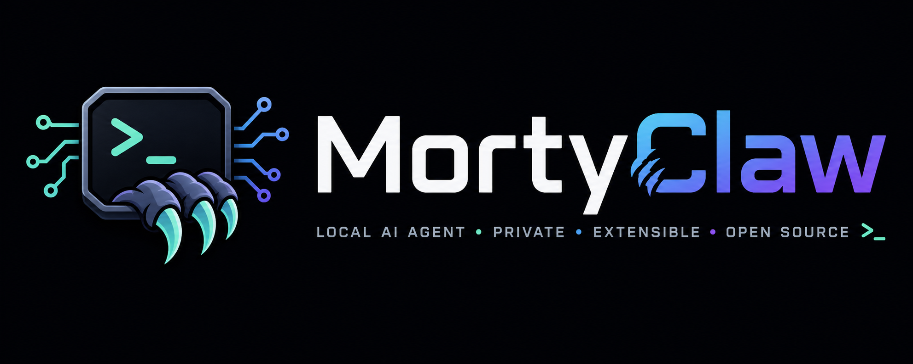

<div align="center">



# MortyClaw

### 一个透明、可控、带记忆和 worker 编排能力的本地工程 Agent 系统

[](#)
[](https://python.org)
[](https://langchain-ai.github.io/langgraph/)
[](https://python.langchain.com/)
[](LICENSE)

**把 LLM 调用、工具执行、审批、安全边界、上下文治理、长期记忆和子任务 worker 放进同一套可观察运行时。**

[快速开始](#快速开始) · [核心能力](#核心能力) · [系统架构](#系统架构) · [Worker 编排](#worker-编排) · [上下文治理](#上下文治理)

</div>

---

## 项目定位

MortyClaw 是一个面向本地开发和复杂工程任务的 Agent runtime。它不是简单的聊天壳，也不再只是单一 ReAct Agent；当前系统已经包含 router、planner、approval gate、reviewer、tool policy、blocking worker subagents、SQLite runtime、记忆系统、上下文压缩和审计日志。

它的设计重点是：

- **透明**：每轮路由、工具调用、审批、worker 生命周期和上下文裁剪都有日志和结构化状态。
- **可控**：高风险写入、命令执行、worker 委派、权限裁剪都走统一治理链路。
- **能做复杂任务**：主 agent 负责全局判断和最终汇总，worker 负责隔离的并行分支，减少主上下文压力。
- **记得住但不乱记**：长期记忆有 profile snapshot、安全扫描、冲突 supersede 和按需召回。
- **上下文不爆炸**：60% 进入确定性裁剪，80% 进入结构化 handoff merge；长工具结果落 artifact，只在 prompt 中保留 stub。

更完整的系统说明见：

- [docs/ARCHITECTURE.md](docs/ARCHITECTURE.md)：整体架构、模块职责、Graph 流程。
- [docs/MEMORY.md](docs/MEMORY.md)：分层记忆、FTS 检索、冲突治理、缓存策略。
- [docs/RUNTIME.md](docs/RUNTIME.md)：SQLite 表、会话、任务、heartbeat、monitor 流程。
- [docs/MORTYCLAW_SYSTEM_FULL_REFERENCE.md](docs/MORTYCLAW_SYSTEM_FULL_REFERENCE.md)：当前系统全量参考文档。

## 核心能力

| 能力 | 当前实现 | 价值 |
| --- | --- | --- |
| 透明 Agent 编排 | LangGraph runtime，router/planner/approval/reviewer/react nodes | 每一步决策和工具动作都可追踪 |
| Blocking worker subagents | `delegate_subagents` 一次完成委派、等待和 compact summary 回收 | 复杂多分支任务可以并行探索，主 agent 不吞全量中间材料 |
| Worker 隔离与权限裁剪 | 独立 thread、独立 worker session、toolsets、blocked tools、write_scope | worker 只拿到完成子任务所需能力，不继承长期记忆和父对话全文 |
| 轻量 worker direct loop | explore/verify worker 不走完整主图，复用 provider 和工具 wrapper | 降低 worker 变成“小主 agent”的额外路由和 finalizer 成本 |
| 高风险审批 | 写文件、执行命令、批量 worker、计划执行等进入 approval gate | 防止 Agent 越权或静默执行危险操作 |
| 工具 schema 分层 | route-aware eager bundle + deferred catalog + `request_tool_schema` | 降低每轮工具 schema token，同时不扩大权限 |
| 上下文分层裁剪 | `<60%` 不处理，`60%-80%` deterministic compaction，`>=80%` handoff merge | 中等压力不额外调用 LLM，高压力保留任务状态 |
| Artifact-backed stub | 长 tool result 先落本地 artifact，再在 prompt 中保留 ref/stub | 减少上下文膨胀，同时保留可恢复证据 |
| 结构化 handoff | JSON handoff merge，带版本、时间、消息范围、证据路径和 artifact ref | 压缩不是流水账 append，而是更新任务状态表 |
| 分层记忆 | working/session/long-term/profile snapshot/MemoryProvider adapter | 区分当前任务状态、会话经验和长期用户偏好 |
| 记忆安全 | profile/long-term 写入前做 prompt injection、exfiltration、隐形字符扫描 | 长期记忆不轻易被恶意内容污染 |
| 跨会话召回 | `search_sessions` 支持 lineage 聚合和 focused summary fallback | 能复用历史经验，而不是只搜索当前会话 |
| SQLite runtime | sessions、tasks、task_runs、session_inbox、worker_runs 持久化 | 运行态可恢复、可审计、可跨进程协作 |
| 监控终端 | JSONL audit log + Rich monitor | 能看到 LLM 输入、工具调用、worker 状态和系统事件 |

## 快速开始

### 安装

```bash
cd MortyClaw
pip install -e .
```

### 配置模型

```bash
mortyclaw config
```

也可以手动创建 `.env`。`.env` 是本地敏感文件，默认不会提交到 Git：

```bash
DEFAULT_PROVIDER=aliyun
DEFAULT_MODEL=glm-5
ALIYUN_API_KEY=sk-your-qwen-key
ALIYUN_BASE_URL=https://dashscope.aliyuncs.com/compatible-mode/v1

# 可选：同时保留 OpenAI / 其他兼容接口
OPENAI_API_KEY=sk-your-openai-key
OPENAI_API_BASE=https://api.example.com/v1
```

支持的 provider 包括 `openai`、`anthropic`、`aliyun`、`tencent`、`z.ai`、`ollama`、`other`。

### 启动交互终端

```bash
mortyclaw run
```

指定或创建会话：

```bash
mortyclaw run --thread-id local_geek_master
mortyclaw run --new
```

交互界面内置快捷命令：

| 命令 | 作用 |
| --- | --- |
| `/sessions` | 在当前聊天界面中查看最近会话、状态、模型和最后活跃时间 |
| `/tasks` | 在当前聊天界面中查看当前会话的待执行任务 |
| `/exit` 或 `/quit` | 退出当前交互终端 |

### 启动监控终端

```bash
mortyclaw monitor --latest
mortyclaw monitor --thread-id local_geek_master
mortyclaw monitor --list-sessions
```

### 启动 heartbeat

```bash
mortyclaw heartbeat
mortyclaw heartbeat --interval 5
mortyclaw heartbeat --once
```

heartbeat 会扫描到期任务，将事件写入 `session_inbox`。对应会话的 `mortyclaw run` 进程会消费 inbox，并把到期任务作为系统内部输入交给 Agent 处理。

## 常用命令

| 命令 | 说明 |
| --- | --- |
| `mortyclaw config` | 交互式配置模型 provider、model、API key 和 base url |
| `mortyclaw run` | 启动默认会话 `local_geek_master` |
| `mortyclaw run --thread-id <id>` | 启动或恢复指定会话 |
| `mortyclaw run --new` | 创建短编号新会话，例如 `session-1`、`session-2` |
| `mortyclaw monitor --latest` | 监控最近活跃会话 |
| `mortyclaw monitor --thread-id <id>` | 监控指定会话 |
| `mortyclaw sessions` | 在 CLI 查看会话列表 |
| `mortyclaw heartbeat` | 启动独立心跳进程 |
| `mortyclaw migrate-tasks` | 将旧 `tasks.json` 导入 SQLite |

## 系统架构

MortyClaw 的主链路是一个受治理的运行图：

```text
user input
  -> router
  -> fast path / slow autonomous path / structured path
  -> planner / approval gate / react node
  -> tool policy + tool execution
  -> reviewer / recovery / final response
```

关键模块：

- `mortyclaw/core/agent/`：agent app、ReAct node、tool policy、memory bridge、recovery。
- `mortyclaw/core/runtime/`：运行状态、审批节点、路径锁、worker supervisor、tool result artifact。
- `mortyclaw/core/routing/`：规则路由、模型路由、web/research 路由。
- `mortyclaw/core/planning/`：计划拆分、风险识别、工具作用域。
- `mortyclaw/core/tools/`：office/project/builtin/web/summarize 工具。
- `mortyclaw/core/storage/`：sessions、conversation、runtime、tasks、workers、program runs。
- `mortyclaw/core/observability/`：audit log、heartbeat、maintenance。

## Worker 编排

MortyClaw 当前支持真正的 worker subagent 编排，而不是只靠主 agent 串行搜索。

### `delegate_subagents`

`delegate_subagents` 是推荐入口。它是 blocking 工具：调用后内部完成 worker 创建、等待、超时/取消处理和结果收口，最后返回 compact summaries。主 agent 正常情况下不需要再调用 `wait_subagents` 或 `list_subagents` 获取结果。

worker task 支持：

- `role`: `explore` / `verify` / `implement`
- `toolsets`: `project_read`、`project_write`、`project_verify`、`project_full`、`research`
- `allowed_tools`: 额外白名单工具
- `write_scope`: 写型 worker 的最小写入范围
- `context_brief`: 压缩背景，不复制父对话全文
- `deliverables`: 子任务交付格式
- `timeout_seconds` / `priority`

### 隔离和安全

- worker 使用独立 `worker_thread_id` 和 branch session。
- worker 不注入父 session memory 和 long-term memory。
- worker 不能嵌套委派，也不能写长期记忆。
- worker effective tools 会被父 agent 当前 tool scope 裁剪。
- `execute_tool_program`、委派工具、记忆写入和调度工具默认被 blocked。
- `implement` worker 保留完整 graph；`explore/verify` worker 使用轻量 direct loop，但仍复用现有 provider 工厂和 BaseTool/ToolNode 安全执行层。

worker 返回给主 agent 的结果只保留：

- `summary`
- `key_files`
- `evidence`
- `changed_files`
- `commands_run`
- `tests_run`
- `blocking_issue`
- `confidence`
- `budget_exhausted`
- `status`

完整中间搜索、读取和工具 trace 留在 worker session/runtime artifact 中，不默认回灌主上下文。

## 上下文治理

MortyClaw 的上下文系统分三层：

| 压力 | 行为 | 是否调用 LLM |
| --- | --- | --- |
| `<60%` | 不处理 | 否 |
| `60%-80%` | deterministic compaction，保守裁剪和 stub | 否 |
| `>=80%` | deterministic compaction + structured handoff merge | 是 |

Medium 阶段不会随便丢历史：

- 可证明重复且已被覆盖的 search/read/status 才会 safely discard。
- 旧 read/test/shell/traceback/diff/worker result 会被压成普通文本 stub。
- `AIMessage(tool_calls)` 与对应 `ToolMessage` 按 group 处理，避免裁剪后出现半条工具调用链。

长 tool result 在 stub 前会保存到本地 artifact：

```text
runtime/artifacts/context/<thread_id>/<turn_id>/<ref_id>.txt
runtime/artifacts/context/<thread_id>/<turn_id>/manifest.jsonl
```

stub 会包含 `ref_id`、`content_hash`、`original_tokens`、`original_chars`、`tool_name`、`args_summary`、`artifact_path` 和 `restore_hint`。需要恢复时可以调用只读工具 `restore_context_artifact(ref_id)`；文件读取类结果也可以优先重新 `read_project_file(path, range)` 获取最新内容。

High 阶段维护一份 merged `structured_handoff`，包含目标、当前状态、已完成步骤、待完成步骤、关键文件、工具结果、worker 结果、命令、错误、风险、开放问题、下一步，以及 `version`、`updated_at`、`source_message_range`、`compression_count`。prompt 层只注入最新 merged handoff，数据库仍保留 append 审计事件。

## 记忆系统

记忆存储在 `workspace/memory/memory.sqlite3`，核心表是 `memory_records` 和 `memory_records_fts`。

当前记忆能力包括：

- working memory：当前任务状态。
- session memory：会话或项目范围内的上下文。
- long-term memory：跨会话长期偏好和事实。
- profile frozen snapshot：会话启动时冻结长期 profile，避免本会话内 profile 写入导致 prompt cache 抖动。
- memory safety：长期/profile 写入前扫描 prompt injection、exfiltration 和 invisible unicode。
- MemoryProvider adapter：把现有 MemoryStore 包装成轻量 provider 接口，为未来外部 memory 服务留扩展点。
- session recall：`search_sessions` 支持 FTS、lineage 聚合、命中窗口和 focused summary fallback。

长期记忆通过 `type + subject` 做冲突治理。例如“以后用中文回答”和“以后用英文回答”会被归到 `user_preference / response_language`，新的 active 记录会 supersede 旧记录。

## 工具和技能

内置工具覆盖：

- 时间和计算：`get_current_time`、`calculator`
- 任务管理：`schedule_task`、`list_scheduled_tasks`、`modify_scheduled_task`、`delete_scheduled_task`
- 记忆画像：`save_user_profile`
- 会话召回：`search_sessions`
- 上下文恢复：`restore_context_artifact`
- Worker 编排：`delegate_subagent`、`delegate_subagents`、`wait_subagents`、`list_subagents`、`cancel_subagent`、`cancel_subagents`
- 项目代码：`read_project_file`、`search_project_code`、`show_git_diff`、`edit_project_file`、`write_project_file`、`apply_project_patch`、`run_project_tests`、`run_project_command`
- 文件和 shell：`list_office_files`、`read_office_file`、`write_office_file`、`execute_office_shell`
- 联网和论文：`tavily_web_search`、`arxiv_rag_ask`
- 外部内容摘要：`summarize_content`
- 系统信息：`get_system_model_info`

动态技能从 `workspace/office/skills` 加载。每个技能目录需要包含 `SKILL.md` 或 `README.md`，运行时会被包装成 `mode='help'` / `mode='run'` 两段式工具。

## 安全边界

MortyClaw 当前的安全策略是“本地工程 Agent 沙盒 + 审批治理”：

- `.env`、`workspace/`、`logs/`、`rick/` 等本地运行数据默认不提交。
- 写文件和 shell 执行受 project root、office root、path lock、tool scope、approval gate 约束。
- 高风险工具必须服从 permission mode、approval mode 和 active tool scope。
- project write/patch/test/command 走项目工具 wrapper，不允许 direct loop 绕过。
- worker 不能获得父 agent 当前未绑定的工具。
- 长期记忆写入前会做安全扫描。

如果要生产部署，建议进一步加入容器隔离、命令白名单、资源限额和更严格的密钥管理。

## 项目结构

```text
MortyClaw/
├── entry/
│   ├── cli.py                 # Typer CLI: config/run/monitor/heartbeat/sessions
│   ├── main.py                # 交互终端、会话启动、inbox 消费
│   └── monitor.py             # Rich 监控终端
├── mortyclaw/core/
│   ├── agent/                 # Agent app、ReAct node、tool policy、memory bridge
│   ├── approval/              # 高风险审批文案与策略
│   ├── context/               # 动态上下文、deterministic compaction、handoff merge
│   ├── llm/                   # Provider 构建入口
│   ├── memory/                # MemoryStore、policy、provider adapter、snapshot
│   ├── observability/         # audit、heartbeat、maintenance
│   ├── planning/              # planner rules 和工具作用域
│   ├── prompts/               # base prompt、context summary、provider cache
│   ├── routing/               # router、classifier、web routing
│   ├── runtime/               # graph、state、worker supervisor、path locks、tool artifacts
│   ├── storage/               # SQLite repositories
│   └── tools/                 # builtin/project/office/web/summarize tools
├── docs/
│   ├── ARCHITECTURE.md
│   ├── MEMORY.md
│   ├── RUNTIME.md
│   └── MORTYCLAW_SYSTEM_FULL_REFERENCE.md
├── tests/                     # unittest 回归测试
├── workspace/                 # 本地运行态数据，默认不提交
└── logs/                      # 会话 JSONL 日志，默认不提交
```

## 测试

当前测试使用 `unittest`：

```bash
./rick/bin/python -m unittest discover -s tests -q
```

测试覆盖 Agent 路由、审批、工具策略、worker 编排、direct loop、上下文裁剪、artifact stub、handoff merge、SQLite runtime、记忆安全、profile snapshot、session recall、FTS 检索和冲突治理。

## 当前边界

- Worker subagent 已经可用于复杂并行任务，但不建议为了轻量任务强行委派。
- `implement` worker 仍保守走完整 graph，避免写型任务绕过审批和路径治理。
- 记忆检索以 SQLite FTS5 为主，不是向量数据库语义检索。
- `restore_context_artifact` 用于明确缺口时恢复证据，不鼓励频繁读取长 artifact。
- UI 已支持 `/sessions` 和 `/tasks`，更完整的 dashboard、记忆管理和任务编辑 UI 仍可继续扩展。

## License

MIT
